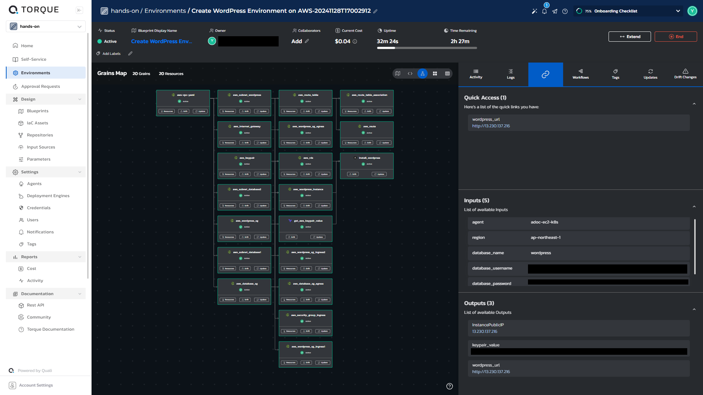

# Torque ハンズオン
- [Torque ハンズオン](#torque-ハンズオン)
  - [事前準備](#事前準備)
    - [GitHub設定](#github設定)
    - [AWS設定](#aws設定)
    - [Torqueアカウント登録](#torqueアカウント登録)
    - [各種設定控え](#各種設定控え)
  - [ハンズオン](#ハンズオン)
  - [宿題（Web3層デモ）](#宿題web3層デモ)
    - [ゴールイメージ](#ゴールイメージ)
    - [ヒント１](#ヒント１)
    - [ヒント２](#ヒント２)
  - [Tips](#tips)
    - [各種グレイン記載例](#各種グレイン記載例)
      - [CloudFormation](#cloudformation)
      - [Terrform](#terrform)
      - [Ansible](#ansible)


## 事前準備
### GitHub設定
https://github.com/adoc-github/torque-hands-on
1. 自分のGitHubアカウントでログイン
2. ハンズオン用リポジトリをフォーク
3. Torqueからリポジトリにアクセスするためのアクセスキーを作成
- Personal access token
  <br>Token name: ```torque-hands-on-repo```
  <br>Token value: ```github_***_***``` ※これは自動生成

### AWS設定
1. Torqueに必要なAWSリソースを作成
   
|                 |サービス|リソース|設定項目|設定値|
|:----------------|:-----:|:-------------:|:---------:|:--:|
|<ul><li>[ ] </ul>|IAM    |User           |ユーザー名   |torque-hands-on|
|<ul><li>[ ] </ul>|-      |-              |許可ポリシー|AdministratorAccess|
|<ul><li>[ ] </ul>|-      |-              |アクセスキー|[作成]|
|<ul><li>[ ] </ul>|-      |Policy         |サービス   |Cost Explorer Service|
|<ul><li>[ ] </ul>|-      |-              |アクション許可   |GetCostAndUsage|
|<ul><li>[ ] </ul>|-      |-              |ポリシー名   |torque-cost-policy|
|<ul><li>[ ] </ul>|-      |Role           |信頼されたエンティティタイプ   |AWS アカウント|
|<ul><li>[ ] </ul>|-      |-              |別の AWS アカウント   |349148204654|
|<ul><li>[ ] </ul>|-      |-              |外部 ID を要求する   |adoc-torque-cost-ext-id|
|<ul><li>[ ] </ul>|-      |-              |ロール名   |torque-cost-role|
|<ul><li>[ ] </ul>|VPC    |VPC            |CIDR|10.0.0.0/24|
|<ul><li>[ ] </ul>|-      |Subnet         |CIDR|10.0.0.0/24|
|<ul><li>[ ] </ul>|-      |InternetGateway|VPCアタッチ|Default VPC|
|<ul><li>[ ] </ul>|EC2    |Instance       |インスタンス名|torque-hands-on-agent|
|<ul><li>[ ] </ul>|-      |-              |AMI|Amazon Linux 2 AMI (HVM)|
|<ul><li>[ ] </ul>|-      |-              |インスタンスタイプ|t3a.large|
|<ul><li>[ ] </ul>|-      |-              |ストレージ|100GiB gp2|

2. インスタンスにminikubeをインストール
<details>
<summary>minikubeインストール</summary>

  ```
  #!/bin/bash

  curl -LO "https://dl.k8s.io/release/$(curl -LS https://dl.k8s.io/release/stable.txt)/bin/linux/amd64/kubectl"
  chmod +x ./kubectl
  mv ./kubectl /usr/local/bin/kubectl

  yum update -y
  amazon-linux-extras install -y docker
  systemctl enable docker
  systemctl start docker
  curl -Lo minikube https://storage.googleapis.com/minikube/releases/latest/minikube-linux-amd64
  chmod +x minikube
  mv minikube /usr/bin/

  yum install -y conntrack
  VERSION="v1.29.0"
  wget https://github.com/kubernetes-sigs/cri-tools/releases/download/$VERSION/crictl-$VERSION-linux-amd64.tar.gz
  tar zxvf crictl-$VERSION-linux-amd64.tar.gz -C /usr/local/bin
  rm -f crictl-v1.29.0-linux-amd64.tar.gz

  yum install -y golang
  git clone https://github.com/Mirantis/cri-dockerd.git
  cd cri-dockerd/
  mkdir bin
  go build -o bin/cri-dockerd
  mkdir -p /usr/local/bin
  install -o root -g root -m 0755 bin/cri-dockerd /usr/local/bin/cri-dockerd
  cp -a packaging/systemd/* /etc/systemd/system
  sed -i -e 's,/usr/bin/cri-dockerd,/usr/local/bin/cri-dockerd,' /etc/systemd/system/cri-docker.service
  systemctl daemon-reload
  systemctl enable cri-docker.service
  systemctl enable --now cri-docker.socket

  cd
  CNI_PLUGIN_VERSION="v1.4.0"
  CNI_PLUGIN_TAR="cni-plugins-linux-amd64-$CNI_PLUGIN_VERSION.tgz"
  CNI_PLUGIN_INSTALL_DIR="/opt/cni/bin"
  curl -LO "https://github.com/containernetworking/plugins/releases/download/$CNI_PLUGIN_VERSION/$CNI_PLUGIN_TAR"
  mkdir -p "$CNI_PLUGIN_INSTALL_DIR"
  tar -xf "$CNI_PLUGIN_TAR" -C "$CNI_PLUGIN_INSTALL_DIR"
  rm -f "$CNI_PLUGIN_TAR"
  minikube start --driver=none
  kubectl apply -f https://raw.githubusercontent.com/coreos/flannel/master/Documentation/kube-flannel.yml
  ```

</details>

### Torqueアカウント登録
https://www.quali.com/torque/

### 各種設定控え
|プラットフォーム|設定項目|設定値|
|:--:|:--:|:--:|
|GitHub|アクセストークン|***|
|AWS|ロール外部ID|***|
|AWS|ロールARN|***|
|AWS|ユーザーアクセスキー|***|
|AWS|ユーザーシークレットキー|***|
|Torque|ユーザー名|***|
|Torque|パスワード|***|


## ハンズオン
1. スペース作成
3. エージェント登録
4. 各種認証情報の登録
5. IaCリポジトリ登録
6. コストダッシュボード設定
7. Blueprint作成
8. Blueprintをもとに環境構築
9. 構築環境へアクセス
2. ユーザ登録(山本をスペースアドミン追加)


## 宿題（Web3層デモ）
### ゴールイメージ

### ヒント１
<details>
<summary>開く</summary>

Blueprintに同じIaCモジュールを2つ以上追加することも可能です。

</details>

### ヒント２
<details>
<summary>開く</summary>

今回用意したIaCモジュールはすべて使います。

</details>

## Tips


<details>
<summary>Torqueオンラインマニュアルはこちら</summary>

https://docs.qtorque.io/

</details>

<details>
<summary>Torqueエージェントのステータス確認方法【Kubernetes】</summary>

Torqueエージェントをインストールしたサーバー上で下記コマンドを実行
```
kubectl get pods -A
```

実行後、下記のような状態のポッドが存在すれば正常に実行中
```
出力例）
NAMESPACE                                      NAME                                                                       READY   STATUS    RESTARTS        AGE
torque-agent-torque-hands-on-agent-dcuahk0rw   torque-agent-rs-e4f8a0-6968c9b7ff-fxx79                                    1/1     Running   1 (2d18h ago)   2d20h
torque-agent-torque-hands-on-agent-dcuahk0rw   torque-agent-rs-e4f8a0-6968c9b7ff-vjgjn                                    1/1     Running   1 (2d18h ago)   2d20h
```

</details>

<details>
<summary>Blueprint Visual Builder (Beta)の仕様</summary>

GUIのBlueprint作成画面にてCloudFormationやTerraformといったIaCを取り扱う場合、
GUI上ではコントロールできない下記のような項目が存在します。
```yaml
      authentication:                 # リソースを作成するユーザの認証情報
        - 'torque-hands-on'           # Torqueにて登録されてる認証情報を利用
      region: '{{ .inputs.region }}'  # IaCによって作成されるリソースの場所　例）ap-northeast-1
```

これらの項目は別途コード編集画面にて直接編集する必要があります。
下記は記載例です。
```diff_yaml
  aws-vpc-yaml:
    kind: 'cloudformation'
    spec:
      source:
        store: 'torque-hands-on'
        path: 'CloudFormation/aws-vpc.yaml'
      agent:
        name: '{{ .inputs.agent }}'
+     authentication:
+       - 'torque-hands-on'
+     region: '{{ .inputs.region }}'
      env-vars: []
      inputs:
        - Cidr: '10.0.0.0/16'
        - VpcName: 'test-vpc'
      outputs:
        - 'VpcId'
```


</details>

<details>
<summary>AnsibleグレインでのInventory記述例</summary>

```diff_yaml
  install_wordpress:
    kind: 'ansible'
    spec:
      source:
        store: 'torque-hands-on'
        path: 'Ansible/install-wordpress.yaml'
      agent:
        name: '{{ .inputs.agent }}'
+     inventory-file:
+       localhost:
+         hosts:
+           127.0.0.1:
+             ansible_connection: 'local'
+       all:
+         hosts:
+           wordpress-server:
+             ansible_host: '{{ .grains.aws_wordpress_instance.outputs.InstancePublicIP }}'
      inputs:
        - keypair_value: '{{ .grains.get_aws_keypair_value.outputs.keypair_value }}'
        - local_file_path: '/tmp/ssh-key.pem'
        - db_name: '{{ .inputs.database_name }}'
        - db_username: '{{ .inputs.database_username }}'
        - db_password: '{{ .inputs.database_password }}'
        - db_endpoint: '{{ .grains.aws_rds.outputs.Endpoint }}'
      outputs:
        - 'result'
    depends-on: 'aws_rds,aws_wordpress_instance,get_aws_keypair_value'
```

</details>

### 各種グレイン記載例
#### CloudFormation

<details><summary>aws-vpc.yaml</summary>

```yaml
  aws-vpc-yaml:
    kind: 'cloudformation'
    spec:
      source:
        store: 'torque-hands-on'
        path: 'CloudFormation/aws-vpc.yaml'
      agent:
        name: '{{ .inputs.agent }}'
      authentication:
        - 'torque-hands-on'
      env-vars: []
      region: '{{ .inputs.region }}'
      inputs:
        - Cidr: '10.0.0.0/16'
        - VpcName: 'test-vpc'
      outputs:
        - 'VpcId'
```

</details>

<details><summary>aws-subnet.yaml</summary>

```yaml
  aws_subnet_wordpress:
    kind: 'cloudformation'
    spec:
      source:
        store: 'torque-hands-on'
        path: 'CloudFormation/aws-subnet.yaml'
      agent:
        name: '{{ .inputs.agent }}'
      authentication:
        - 'torque-hands-on'
      region: '{{ .inputs.region }}'
      inputs:
        - VpcId: '{{ .grains.aws-vpc-yaml.outputs.VpcId }}'
        - CidrBlock: '10.0.0.0/24'
        - AvailabilityZone: 'ap-northeast-1a'
        - ResourceName: 'wordpress-subnet'
      outputs:
        - 'SubnetId'
    depends-on: 'aws-vpc-yaml'
```

</details>

<details><summary>aws-internet-gateway.yaml</summary>

```yaml
  aws_internet_gateway:
    kind: 'cloudformation'
    spec:
      source:
        store: 'torque-hands-on'
        path: 'CloudFormation/aws-internet-gateway.yaml'
      agent:
        name: '{{ .inputs.agent }}'
      authentication:
        - 'torque-hands-on'
      region: '{{ .inputs.region }}'
      inputs:
        - VpcId: '{{ .grains.aws-vpc-yaml.outputs.VpcId }}'
      outputs:
        - 'IgwId'
    depends-on: 'aws-vpc-yaml'
```

</details>

<details><summary>aws-route-table.yaml</summary>

```yaml
  aws_route_table:
    kind: 'cloudformation'
    spec:
      source:
        store: 'torque-hands-on'
        path: 'CloudFormation/aws-route-table.yaml'
      agent:
        name: '{{ .inputs.agent }}'
      authentication:
        - 'torque-hands-on'
      region: '{{ .inputs.region }}'
      inputs:
        - VpcId: '{{ .grains.aws-vpc-yaml.outputs.VpcId }}'
        - ResourceName: 'test-rt'
      outputs:
        - 'RouteTableId'
    depends-on: 'aws_internet_gateway,aws-vpc-yaml'
```

</details>

<details><summary>aws-route.yaml</summary>

```yaml
  aws_route:
    kind: 'cloudformation'
    spec:
      source:
        store: 'torque-hands-on'
        path: 'CloudFormation/aws-route.yaml'
      agent:
        name: '{{ .inputs.agent }}'
      authentication:
        - 'torque-hands-on'
      region: '{{ .inputs.region }}'
      inputs:
        - RouteTableId: '{{ .grains.aws_route_table.outputs.RouteTableId }}'
        - DestinationCidrBlock: '0.0.0.0/0'
        - GatewayId: '{{ .grains.aws_internet_gateway.outputs.IgwId }}'
      outputs:
        - 'RouteId'
    depends-on: 'aws_route_table,aws_internet_gateway'
```

</details>

<details><summary>aws-security-group.yaml</summary>

```yaml
  aws_wordpress_sg:
    kind: 'cloudformation'
    spec:
      source:
        store: 'torque-hands-on'
        path: 'CloudFormation/aws-security-group.yaml'
      agent:
        name: '{{ .inputs.agent }}'
      authentication:
        - 'torque-hands-on'
      region: '{{ .inputs.region }}'
      inputs:
        - VpcId: '{{ .grains.aws-vpc-yaml.outputs.VpcId }}'
        - NamePrefix: 'wordpress'
      outputs:
        - 'SecurityGroupId'
    depends-on: 'aws-vpc-yaml'
```

</details>

<details><summary>aws-security-group-egress.yaml</summary>

```yaml
  aws_wordpress_sg_egress:
    kind: 'cloudformation'
    spec:
      source:
        store: 'torque-hands-on'
        path: 'CloudFormation/aws-security-group-egress.yaml'
      agent:
        name: '{{ .inputs.agent }}'
      authentication:
        - 'torque-hands-on'
      region: '{{ .inputs.region }}'
      inputs:
        - SecurityGroupId: '{{ .grains.aws_wordpress_sg.outputs.SecurityGroupId }}'
        - CidrBlock: '0.0.0.0/0'
        - FromPort: '0'
        - ToPort: '0'
        - Protocol: '-1'
      outputs:
        - 'SecurityGroupRuleId'
    depends-on: 'aws_wordpress_sg'
```

</details>

<details><summary>aws-security-group-ingress.yaml</summary>

```yaml
  aws_wordpress_sg_ingress1:
    kind: 'cloudformation'
    spec:
      source:
        store: 'torque-hands-on'
        path: 'CloudFormation/aws-security-group-ingress.yaml'
      agent:
        name: '{{ .inputs.agent }}'
      authentication:
        - 'torque-hands-on'
      region: '{{ .inputs.region }}'
      inputs:
        - SecurityGroupId: '{{ .grains.aws_wordpress_sg.outputs.SecurityGroupId }}'
        - CidrBlock: '0.0.0.0/0'
        - FromPort: '22'
        - ToPort: '22'
        - Protocol: 'tcp'
      outputs:
        - 'SecurityGroupRuleId'
    depends-on: 'aws_wordpress_sg'
```

</details>

<details><summary>aws-route-table-association.yaml</summary>

```yaml
  aws_route_table_association:
    kind: 'cloudformation'
    spec:
      source:
        store: 'torque-hands-on'
        path: 'CloudFormation/aws-route-table-association.yaml'
      agent:
        name: '{{ .inputs.agent }}'
      authentication:
        - 'torque-hands-on'
      region: '{{ .inputs.region }}'
      inputs:
        - SubnetId: '{{ .grains.aws_subnet_wordpress.outputs.SubnetId }}'
        - RouteTableId: '{{ .grains.aws_route_table.outputs.RouteTableId }}'
    depends-on: 'aws_route_table,aws_subnet_wordpress'
```

</details>

<details><summary>aws-keypair.yaml</summary>

```yaml
  aws_keypair:
    kind: 'cloudformation'
    spec:
      source:
        store: 'torque-hands-on'
        path: 'CloudFormation/aws-keypair.yaml'
      agent:
        name: '{{ .inputs.agent }}'
      authentication:
        - 'torque-hands-on'
      region: '{{ .inputs.region }}'
      inputs:
        - KeyName: 'test-kp'
        - KeyType: 'rsa'
        - KeyFormat: 'pem'
      outputs:
        - 'KeyPairName'
        - 'KeyPairId'
```

</details>

<details><summary>aws-rds.yaml</summary>

```yaml
  aws_rds:
    kind: 'cloudformation'
    spec:
      source:
        store: 'torque-hands-on'
        path: 'CloudFormation/aws-rds.yaml'
      agent:
        name: '{{ .inputs.agent }}'
      authentication:
        - 'torque-hands-on'
      region: '{{ .inputs.region }}'
      inputs:
        - Subnet1Id: '{{ .grains.aws_subnet_database1.outputs.SubnetId }}'
        - Subnet2Id: '{{ .grains.aws_subnet_database2.outputs.SubnetId }}'
        - SecurityGroupId: '{{ .grains.aws_database_sg.outputs.SecurityGroupId }}'
        - DBName: '{{ .inputs.database_name }}'
        - DBUsername: '{{ .inputs.database_username }}'
        - DBPassword: '{{ .inputs.database_password }}'
      outputs:
        - 'Endpoint'
    depends-on: 'aws_subnet_database1,aws_subnet_database2,aws_database_sg'
```

</details>


#### Terrform

<details><summary>get-aws-keypair-value</summary>

```yaml
  get_aws_keypair_value:
    kind: 'terraform'
    spec:
      source:
        store: 'torque-hands-on'
        path: 'Terraform/get-aws-keypair-value'
      agent:
        name: '{{ .inputs.agent }}'
      authentication:
        - 'torque-hands-on'
      region: '{{ .inputs.region }}'
      inputs:
        - keypair_id: '{{ .grains.aws_keypair.outputs.KeyPairId }}'
      outputs:
        - 'keypair_value'
    depends-on: 'aws_keypair'
```

</details>


#### Ansible

<details><summary>install-wordpress.yaml</summary>

```yaml
  install_wordpress:
    kind: 'ansible'
    spec:
      source:
        store: 'torque-hands-on'
        path: 'Ansible/install-wordpress.yaml'
      agent:
        name: '{{ .inputs.agent }}'
      inventory-file:
        localhost:
          hosts:
            127.0.0.1:
              ansible_connection: 'local'
        all:
          hosts:
            wordpress-server:
              ansible_host: '{{ .grains.aws_wordpress_instance.outputs.InstancePublicIP }}'
      inputs:
        - keypair_value: '{{ .grains.get_aws_keypair_value.outputs.keypair_value }}'
        - local_file_path: '/tmp/ssh-key.pem'
        - db_name: '{{ .inputs.database_name }}'
        - db_username: '{{ .inputs.database_username }}'
        - db_password: '{{ .inputs.database_password }}'
        - db_endpoint: '{{ .grains.aws_rds.outputs.Endpoint }}'
      outputs:
        - 'result'
    depends-on: 'aws_rds,aws_wordpress_instance,get_aws_keypair_value'
```

</details>